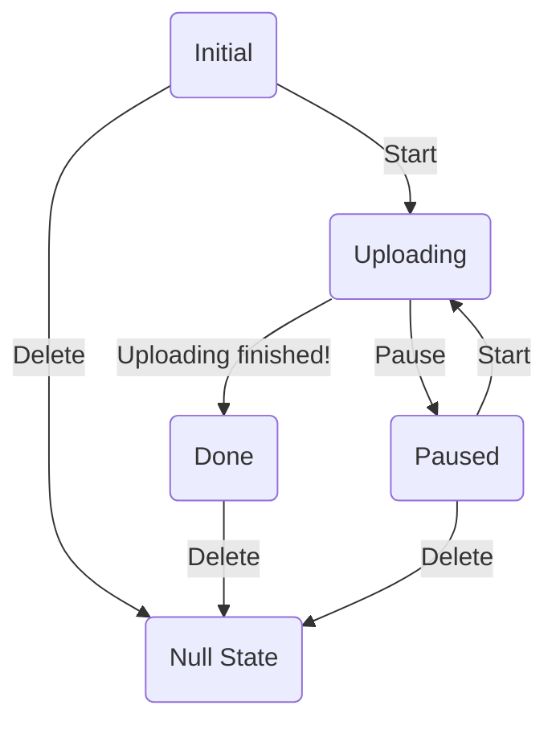

### There are two buttons on the panel.
- The start / pause button  ⏯️ : to start or pause the file upload.
- The delete button ❎ : to delete the file.

### The upload state change diagram

```mermaid
flowchart TD

A(Initial) -->|Start| B(Uploading)
A -->|Delete| Z(Null State)
B --> |Uploading finished!| C(Done)
C --> |Delete| Z
B --> |Pause| D(Paused)
D --> |Start| B
D --> |Delete| Z
```
